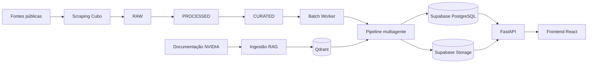
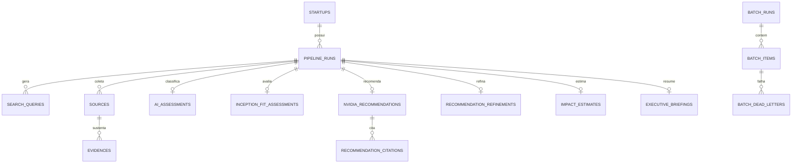
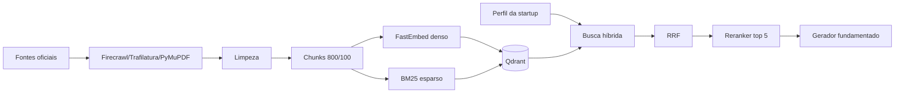

# Work Architecture Document - NVIDIA Startup AI Radar

## 1. Introdução

Este documento descreve a arquitetura implementada do NVIDIA Startup AI Radar. Ele orienta desenvolvedores, arquitetos e líderes técnicos responsáveis por operar, revisar ou evoluir a plataforma.

O escopo inclui aquisição e lapidação de startups, investigação multiagente, RAG NVIDIA, persistência, API, worker, frontend, segurança, observabilidade e infraestrutura. Detalhes de uso rápido permanecem no `README.md`.

## 2. Visão de Negócio

### 2.1 Problema

Startups que apenas encapsulam APIs genéricas de IA possuem diferenciação frágil. O NVIDIA Inception Brasil precisa identificar empresas com evidências reais de IA, compreender sua maturidade e conectar necessidades técnicas a produtos e benefícios NVIDIA sem depender de análise manual dispersa.

### 2.2 Objetivos

- Mapear startups a partir de fontes públicas rastreáveis.
- Distinguir IA própria, IA integrada, consumo de APIs e ausência de evidência de IA.
- Recomendar tecnologias NVIDIA somente quando houver aderência e documentação de suporte.
- Produzir um briefing executivo acionável para o relacionamento com a startup.
- Preservar fontes, decisões, erros e histórico de cada execução.

### 2.3 Critérios de sucesso

- Toda conclusão relevante possui evidência e URL associada.
- `AI-native` exige evidência atribuível de desenvolvimento próprio.
- Recomendações citam chunks da base oficial NVIDIA.
- Falhas individuais não corrompem nem interrompem todo o lote.
- O usuário acompanha progresso e resultados em uma interface autenticada.
- Testes, build e verificações de saúde permanecem aprovados.

## 3. Arquitetura de Alto Nível

### 3.1 Fluxo ponta a ponta

1. O scraper coleta o portfólio Cubo Itaú por API, Jina ou HTML heurístico.
2. A camada PROCESSED normaliza campos e calcula qualidade, preservando o dado bruto.
3. A camada CURATED deduplica, cria IDs estáveis e decide elegibilidade operacional.
4. Um lote copia cada startup para `batch_items` e é adquirido pelo worker por lease.
5. O pipeline planeja buscas, coleta páginas, valida evidências e classifica IA.
6. O Inception Fit separa benefícios do programa de recomendações tecnológicas.
7. O RAG recupera documentação oficial e gera recomendações citadas.
8. Os agentes refinam o roadmap, estimam impacto, geram o briefing e um Blueprint de POC mensurável.
9. O Supabase persiste artefatos; traces extensos seguem para Storage.
10. FastAPI entrega contratos normalizados ao frontend React.

### 3.2 Decisões arquiteturais

| Decisão | Escolha | Justificativa |
|---|---|---|
| Orquestração | LangGraph StateGraph | Nós explícitos, estado tipado, retry, ciclo condicional de investigação e checkpoint SQLite permitem retomada e auditoria. |
| Busca | SearXNG, DDGS e Firecrawl | Evita custo obrigatório do Brave; mantém fallback gratuito e extração JS opcional. |
| Banco relacional | Supabase PostgreSQL | Transações, Data API, Auth, RLS, Storage e operação gerenciada. |
| Banco vetorial | Qdrant | Vetores densos e esparsos nomeados, filtros de metadados e execução local por Docker. |
| Processamento | Worker com polling e lease | Evita manter requisições HTTP longas e permite retomada segura. |
| Frontend | React 19 + Vite + Zustand | Aplicação SPA tipada, autenticação Supabase e bundle dividido por rota. |

## 4. Arquitetura de Agentes

O pipeline operacional possui nove estágios. Cada entrada e saída é validada com Pydantic e JSON Schema. O modo padrão é determinístico; OpenAI é opcional nos componentes configuráveis do RAG.

| Estágio | Entrada | Saída | Lógica e tratamento de erro | Motor sugerido |
|---|---|---|---|---|
| Search Planner | `PipelineInput` | consultas e tarefas priorizadas | Combina nome, domínio, vertical e termos de IA; retry controlado | Regras determinísticas |
| Scraper | plano de busca | resultados, páginas e erros | SearXNG/DDGS/Firecrawl, RSS, Trafilatura, cache e limites por lote | Sem LLM |
| Evidence Validator | conteúdo coletado | evidências altas, médias e descartadas | Verifica URL, homônimo, credibilidade, menção e corroboração | Regras determinísticas |
| AI Maturity Classifier | evidências validadas | classe, nível, confiança e tecnologias | `AI-native` exige prova forte e atribuível; falha gera etapa parcial | Regras determinísticas |
| Inception Fit | perfil e evidências | elegibilidade, estágio, necessidades e benefícios | Não presume elegibilidade; produz perguntas em aberto | Regras determinísticas |
| NVIDIA Recommender RAG | maturidade e gaps | tecnologias, chunks e citações | Busca híbrida, reranking e filtro; Inception é excluído da lista tecnológica | Determinístico; OpenAI opcional |
| Recommendation Refiner | recomendação RAG | prioridades, complexidade e roadmap | Cruza dependências, fase, vertical e fontes; remove itens sem categoria técnica | Regras determinísticas |
| Impact Estimator | roadmap | impacto, KPIs, premissas e incertezas | Não inventa ganho quantitativo; exige benchmark ou recomenda POC | Regras determinísticas |
| Briefing Generator | todos os artefatos | Markdown executivo | Consolida perfil, diagnóstico, roadmap, impacto e apêndice de fontes | Template determinístico |
| POC Blueprint | recomendação refinada e impacto | plano de POC em JSON e Markdown | Define baseline, KPIs, aceite, riscos e cronograma sem prometer ganhos | Regras determinísticas |

### 4.1 Contratos e estado

- Schemas centrais: `backend/app/core/schemas.py`.
- Validação dupla: Pydantic e JSON Schema em `core/contracts.py`.
- Retry: Tenacity e política em `core/retry.py`.
- Cache: hash SHA-256 de payload canônico e gravação atômica.
- Trace por estágio: status, duração, tentativa, saída, erros e warnings.
- Checkpoint por `thread_id`: SQLite local, com o ID do item de lote reutilizado nas retomadas.
- Aresta condicional: evidência insuficiente com dados coletados retorna ao Search Planner uma vez com contexto complementar.
- Falha não crítica: resultado `parcial`, com dependências posteriores ignoradas de forma explícita.
- Falha de persistência: registrada no trace sem ocultar o resultado computado.

## 5. Arquitetura de Dados

### 5.1 Camadas de aquisição

| Camada | Responsabilidade |
|---|---|
| RAW | Resposta original da fonte e timestamp, sem transformação destrutiva. |
| PROCESSED | Normalização, validação, score de qualidade e referência ao RAW. |
| CURATED | Consolidação, deduplicação, ID estável e entrada pronta para investigação. |

### 5.2 PostgreSQL

O schema `nvidia_inception` é criado por `backend/app/persistence/migration.sql`.

Tabelas de suporte incluem `web_content_cache`, `external_api_usage`, `revoked_auth_tokens` e `api_rate_limits`. Índices únicos evitam duplicação de startups por nome, site ou ID externo.

### 5.3 Storage e retenção

- Bucket privado padrão: `pipeline-traces`.
- Traces são gravados por `pipeline_run_id`.
- O serviço de retenção remove traces, cache web, tokens revogados e rate limits expirados.
- Backups usam `pg_dump`/`pg_restore` por scripts dedicados.
- Dados coletados são públicos, mas podem conter conteúdo sujeito a termos de uso; retenção deve ser aprovada antes de produção.

### 5.4 Qdrant

- Coleção padrão: `nvidia_knowledge`.
- Vetores: `dense` e `bm25`.
- ID: SHA-256 estável de URL, índice e conteúdo.
- Metadados: tecnologia, tipo, dores, perfis aplicáveis, seção e URL.
- Upsert idempotente em lotes de 100.

## 6. Arquitetura do RAG

### 6.1 Ingestão

O catálogo em `rag/knowledge_sources.py` aponta para documentação oficial. HTML é convertido para texto principal; PDFs usam PyMuPDF. O `NVIDIAChunker` aplica `RecursiveCharacterTextSplitter` com 800 caracteres, overlap 100 e separadores orientados a títulos.

### 6.2 Recuperação

O sistema recupera até 20 candidatos densos e lexicais, combina rankings com Reciprocal Rank Fusion e filtra por perfil. O padrão usa reranking lexical reproduzível; BGE (`BAAI/bge-reranker-v2-m3`) pode ser ativado.

### 6.3 Geração

O gerador determinístico recomenda somente tecnologias presentes nos chunks recuperados e exige citações. O gerador OpenAI opcional recebe apenas perfil e contexto recuperado e continua sujeito ao mesmo schema. NVIDIA Inception é classificado como programa e tratado exclusivamente pelo Inception Fit.

## 7. Arquitetura da API

FastAPI expõe documentação em `/docs` e OpenAPI em `/openapi.json`.

| Grupo | Rotas |
|---|---|
| Saúde | `/health`, `/ready` |
| Dashboard | `/api/v1/metrics` |
| Startups | `/api/v1/startups`, `/api/v1/startups/{id}` |
| Execuções | `/api/v1/runs/{id}`, `/evidences`, `/briefing`, `/poc-blueprint` |
| Lotes | criação, listagem, detalhe, itens, run, resume, cancel e DLQ |
| Autenticação | revogação de token |
| Observabilidade | `/metrics` em formato Prometheus |

O middleware adiciona `X-Request-ID`, duração e log estruturado. CORS é restrito às origens configuradas. Contratos de resposta normalizam nomes internos do banco para o frontend.

## 8. Arquitetura do Worker

1. O endpoint cria `batch_run` e `batch_items` em estado `pending`.
2. O worker adquire lote com operação atômica e registra `worker_id`.
3. Heartbeats renovam o lease durante chamadas longas.
4. Cada item executa o StateGraph com persistência por estágio e checkpoint associado ao ID do item.
5. Falhas elegíveis voltam à fila até `max_attempts`.
6. Falhas esgotadas vão para `batch_dead_letters` com payload e erro.
7. Replay da DLQ é explícito; lotes interrompidos podem ser retomados.

O processamento é sequencial por padrão para respeitar limites de APIs e fontes. Escala horizontal exige coordenação de leases e limites globais já centralizados no PostgreSQL.

## 9. Arquitetura do Frontend

### 9.1 Stack e estrutura

- React 19, TypeScript 6 e Vite 8.
- React Router 7 com páginas carregadas por `lazy`/`Suspense`.
- Zustand para sessão e papel do usuário.
- Axios com interceptor JWT e refresh de sessão.
- Recharts para distribuição de classificação.
- React Markdown para briefings.

### 9.2 Fluxos

- Login Supabase com erros localizados.
- Dashboard com métricas, análises recentes e disparo individual.
- Lista com busca e filtros combinados de classe, nível, status e cidade.
- Detalhe com diagnóstico, evidências, recomendação, impacto, briefing, POC Blueprint e histórico.
- Lotes com RBAC, progresso, polling, itens, DLQ e replay.
- Layout desktop e navegação inferior mobile.

O frontend usa variáveis `VITE_*`; nenhuma chave secreta é empacotada. A API é acessada pelo proxy Vite no desenvolvimento e pela URL pública em produção.

## 10. Segurança

- Tokens Supabase são validados por JWKS, algoritmo ES256/RS256, issuer, audience e expiração.
- Papéis: `readonly`, `analyst` e `admin` em `app_metadata.radar_role`.
- O backend permanece autoridade; o frontend apenas adapta os controles visíveis.
- Tokens revogados são bloqueados por `jti` ou `session_id`.
- Rate limits são atômicos no PostgreSQL e variam por papel.
- RLS está habilitado nas tabelas; o service role é exclusivo do backend.
- `.env`, traces e segredos locais não são versionados.
- Gitleaks integra o CI.
- Produção deve usar HTTPS no proxy/load balancer e `ALLOW_LEGACY_API_KEY=false`.

## 11. Observabilidade

- Structlog em JSON com request ID, estágio, startup, duração e erro.
- Trace persistido por execução e artefatos por estágio.
- `/api/v1/metrics` entrega indicadores do dashboard.
- `/metrics` entrega séries Prometheus protegidas por token próprio.
- Alertas cobrem worker sem heartbeat, backlog, lease vencido e falhas do Firecrawl.
- `/ready` verifica Supabase, Qdrant e SearXNG; estado parcial é `503 degraded`.

## 12. Deploy e Infraestrutura

### 12.1 Desenvolvimento

O `docker-compose.yml` possui Qdrant e SearXNG no profile padrão; API e worker ficam no profile `backend`; Prometheus usa o profile `observability`.

### 12.2 Produção sugerida

- API e worker como processos/containers independentes.
- Supabase gerenciado e Qdrant Cloud ou volume persistente com backup.
- Frontend estático em CDN com HTTPS.
- Segredos em secret manager, nunca em imagem ou repositório.
- Health checks em `/health` e `/ready`.
- Escalonamento do worker condicionado aos limites de busca e Firecrawl.

### 12.3 CI/CD

GitHub Actions executa Ruff, mypy, pytest, Gitleaks, build Docker e smoke tests. A imagem pode ser publicada no GHCR por SHA. A migration possui workflow manual separado e deve usar ambiente protegido com revisor.

## 13. Limitações e Débitos Técnicos

- 49 perfis atuais não possuem cidade/estado confirmados; o sistema não inventa localização.
- Fontes externas podem mudar HTML, políticas ou disponibilidade.
- Firecrawl depende de cota externa quando habilitado.
- O reranker lexical é inferior a um cross-encoder BGE em consultas ambíguas.
- O modo determinístico prioriza auditabilidade, mas pode produzir texto menos natural.
- Testes frontend de componentes estão preparados, porém a cobertura E2E autenticada deve ser ampliada.
- O repositório ainda precisa de uma licença formal e política organizacional de privacidade/retenção.
- Métricas quantitativas de impacto permanecem hipóteses até uma POC com baseline da startup.

## 14. Glossário

| Termo | Definição |
|---|---|
| AI-native | IA é parte central do produto e há evidência atribuível de desenvolvimento próprio. |
| AI-enabled | IA melhora um produto existente, sem prova suficiente de modelo próprio. |
| API-consumer | Uso predominante de APIs/modelos externos prontos. |
| Non-AI | Não há evidência qualificada de IA. |
| Chunking | Divisão de documentos em unidades recuperáveis com overlap. |
| Embedding | Representação vetorial de texto para similaridade semântica. |
| BM25 | Ranking lexical baseado em frequência e raridade de termos. |
| RRF | Fusão de rankings densos e esparsos por posição recíproca. |
| Reranking | Reordenação dos candidatos por relevância mais precisa. |
| RAG | Geração aumentada por recuperação de conhecimento externo. |
| Lease | Reserva temporária de trabalho renovada por heartbeat. |
| DLQ | Fila de itens que esgotaram tentativas e exigem intervenção. |
| POC | Prova de conceito com baseline, métrica e critério de aceite. |

## 15. Referências

- [NVIDIA Inception](https://www.nvidia.com/en-us/startups/)
- [NVIDIA NIM](https://www.nvidia.com/en-us/ai-data-science/products/nim-microservices/)
- [NVIDIA NeMo](https://www.nvidia.com/en-us/ai-data-science/products/nemo/)
- [NVIDIA Triton Inference Server](https://developer.nvidia.com/triton-inference-server)
- [NVIDIA TensorRT-LLM](https://github.com/NVIDIA/TensorRT-LLM)
- [NVIDIA RAPIDS](https://rapids.ai/)
- [CUDA Toolkit](https://developer.nvidia.com/cuda-toolkit)
- [Qdrant](https://qdrant.tech/documentation/)
- [Supabase](https://supabase.com/docs)
- [FastAPI](https://fastapi.tiangolo.com/)
- [LangChain](https://python.langchain.com/docs/)
- [React](https://react.dev/)
